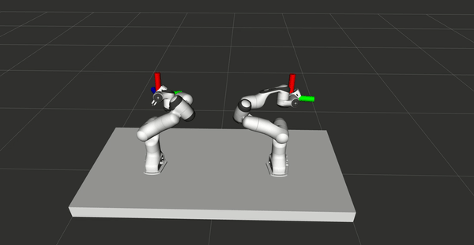

# MoveIt Control with HTC Vive
### Preleminary
The VR control system is presented in the [MCs thesis](https://www.diva-portal.org/smash/get/diva2:1473629/FULLTEXT01.pdf) and consider refering the thesis if you found this work useful. The main file in this repository is [moveit_controller.cpp](./src/controller/moveit_controller.cpp).

### Requirements
[MoveIt installed from source](https://moveit.ros.org/install/source/) and [ros_controllers](http://wiki.ros.org/ros_controllers).   
It has been tested for Melodic and Noetic.  

Build using:
```
catkin_make -DPYTHON_EXECUTABLE=/usr/bin/python3
```

### Overview
This package is used to control MoveIt move groups with HTC Vive. It is built primarily for bimanual robotics systems, but can easily be transferred for one-armed robots.  The system is tested in simulation using the ROS packages [panda_dual_gazebo](https://github.com/Machine-Jonte/panda_dual_gazebo) and [panda_dual_gazebo_moveit_config](https://github.com/Machine-Jonte/panda_dual_gazebo_moveit_config)

<p align="center">
  
</p>

## How to use
To read the VR controller data please use the package [vive_ros (modified)](https://github.com/machine-jonte/vive_ros). Note, the vive_ros package in my repository is a modified version of [vive_ros](https://github.com/robosavvy/vive_ros). For a simple launch file of how to start the system, look at [controller.launch](./launch/controller.launch).

To use the package run:
``` xml
  <!-- TWO ARM EXAMPLE -->
  <!-- To alter this package to fit your robot, add parameters here -->
  <node name="moveit_controller" pkg="moveit_vive" type="moveit_controller" output="screen">
    <param name="right_controller_name" type="str" value="right"/>
    <param name="left_controller_name" type="str" value="left"/>
    <param name="robot_planning_group" type="str" value="dual"/>
    <param name="right_end_link_name" type="str" value="panda_1_link8"/>
    <param name="left_end_link_name" type="str" value="panda_2_link8"/>
    <param name="number_of_arms" type="int" value="2"/>  
  </node>

  <!-- ONE ARM EXAMPLE -->
  <!-- USE RIGHT WHEN INIT -->
  <!-- To alter this package to fit your robot, add parameters here -->
  <node name="moveit_controller" pkg="moveit_vive" type="moveit_controller" output="screen">
    <param name="right_controller_name" type="str" value="right"/>
    <param name="robot_planning_group" type="str" value="dual"/>
    <param name="right_end_link_name" type="str" value="panda_1_link8"/>
    <param name="number_of_arms" type="int" value="1"/>  
  </node>
```

In order to control the gripper, the script gripper_control.py can be executed.
``` xml
<node name="panda_<arm>_gripper" pkg="moveit_vive" type="gripper_control.py">
  <param name="controller_id" type="str" value="<arm>"/>
</node>
```

## Quick test it works
In order for you to utalize the entire purpose of this package is that you have HTC-VIVE VR gear (and publishing messages using [vive_ros (modified)](https://github.com/machine-jonte/vive_ros)). But what you can do before setting up the VR gear is:  

1. (optional) Download [panda_dual_gazebo](https://github.com/Machine-Jonte/panda_dual_gazebo) and [panda_dual_gazebo_moveit_config](https://github.com/Machine-Jonte/panda_dual_gazebo_moveit_config).  
(alternative) Use your own robot URDF setup with MoveIt.

2. Download MoveIt and build from source (use catkin_make when building).  

3. Make sure the robot works with MoveIt and note:
* The name of your move_group
* End link name
* Name of controller

4. Download and build this package and update the [controller.launch](./launch/controller.launch). See example above. Use the information you noted from step 3.

5. rosrun moveit_vive [circle.py](./src/tests/circle.py). This should make your robot move in a circular motion. If this works, your robot should be ready to go with the published messages from the [vive_ros (modified)](https://github.com/machine-jonte/vive_ros).

