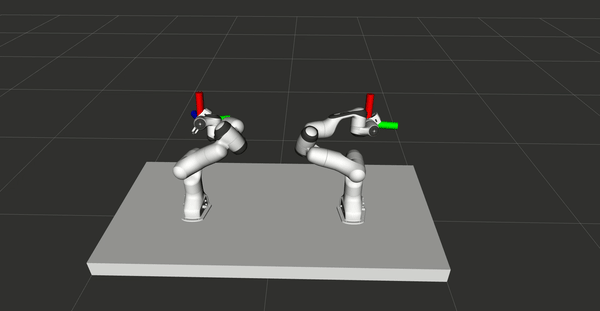

# MoveIt Control with HTC Vive
### Preleminary
The VR control system is presented in the MCs thesis (link soon to arrive) and consider refering the thesis if you found this work useful.

### Overview
This package is used to control MoveIt move groups with HTC Vive. It is built primarily for bimanual robotics systems, but can easily be transferred for one-armed robots.  The system is tested in simulation using the ROS packages [panda_dual_gazebo](https://github.com/Machine-Jonte/panda_dual_gazebo) and [panda_dual_gazebo_moveit_config](https://github.com/Machine-Jonte/panda_dual_gazebo_moveit_config)

<p align="center">
  
</p>

## How to use
To read the VR controller data please use the package [vive_ros (modified)](https://github.com/robosavvy/vive_ros). Note, the vive_ros package in my repository is a modified version of [vive_ros](https://github.com/robosavvy/vive_ros). For a simple launch file of how to start the system, look at [controller.launch](./launch/controller.launch).

To use the package run:
``` xml
<node name="moveit_controller" pkg="moveit_vive" type="moveit_controller" output="screen">
  <!-- To alter this package to fit your robot, add parameters here -->
</node>
```
If you are not using two Panda Franka Emika, the following variables need changing (found in moveit_controller.cpp). Note, the change can be specified using parameters in the expression above.
``` cpp
node_handle.param<std::string>("right_controller_name", rightControllerName, "right");
node_handle.param<std::string>("left_controller_name", leftControllerName, "left");
node_handle.param<std::string>("dual_planning_group", dualArmPlanningGroup, "dual");
node_handle.param<std::string>("right_end_link_name", rightEndLinkName, "panda_1_link8");
node_handle.param<std::string>("left_end_link_name", leftEndLinkName, "panda_2_link8");
```

In order to control the gripper, the script gripper_control.py can be executed.
``` xml
<node name="panda_<arm>_gripper" pkg="moveit_vive" type="gripper_control.py">
  <param name="controller_id" type="str" value="<arm>"/>
</node>
```


## Cartesian Path Planning
As Cartesian path planning appeared to be not as good, the code was not rewritten for that case. The concept (in the bad code located in LEGACY) can be found in the files: "panda_dual_\<...\>.cpp".


